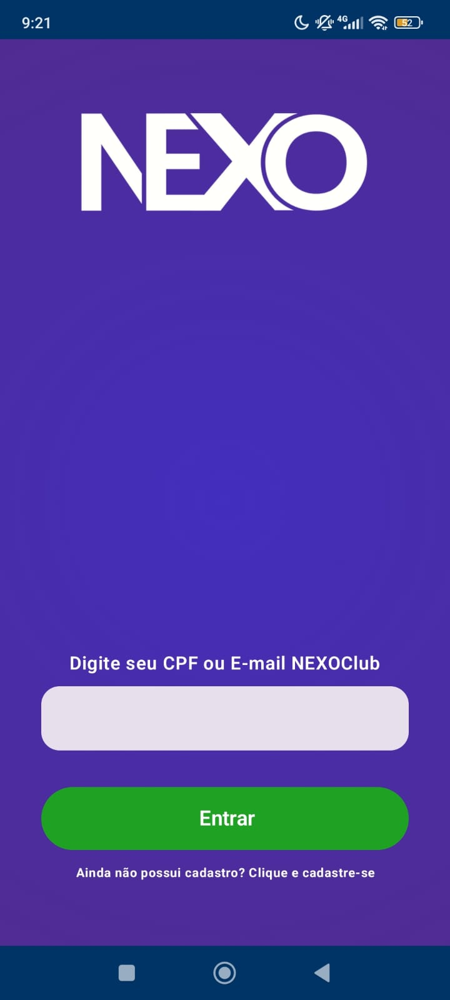

# nexo_mobile_development
Aplicativo Android de para o NEXOClub, clube de fidelidade do minimercado NEXO, desenvolvido em Kotlin e Jetpack Compose

## Funcionamento
- Clone o repositório em sua máquina e abra o projeto no Android Studio (versão Koala 2024.1.2 ou mais atualizada)
- Use o emulador do Android Studio ou emule em seu dispositivo móvel Android via cabo ou Wi-Fi

##
